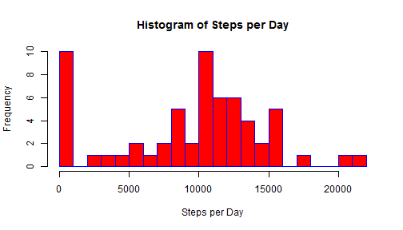
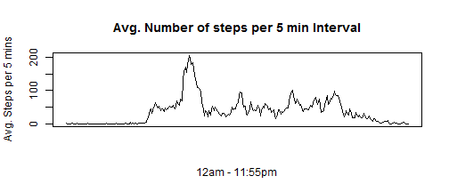
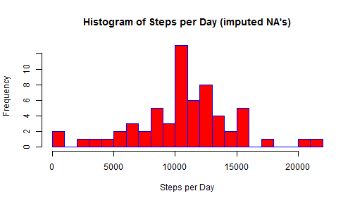
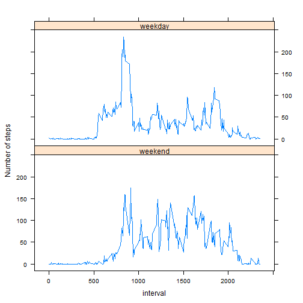

##Loading and pre-processing the data
The data can be downloaded from the this [link]("https://d396qusza40orc.cloudfront.net/repdata%2Fdata%2Factivity.zip")  
Save the zip file into your working directory and then unzip. Read in the csv file and use head() and tail() to take a first look at the data. There are 17568 rows and 3 variables. Note that there are some NA values in the steps column.


```r
if(!file.exists("activity.csv")){unzip("activity.zip")}
activity <- read.csv("activity.csv")
str(activity)
```

```
## 'data.frame':	17568 obs. of  3 variables:
##  $ steps   : int  NA NA NA NA NA NA NA NA NA NA ...
##  $ date    : Factor w/ 61 levels "2012-10-01","2012-10-02",..: 1 1 1 1 1 1 1 1 1 1 ...
##  $ interval: int  0 5 10 15 20 25 30 35 40 45 ...
```

```r
head(activity)
```

```
##   steps       date interval
## 1    NA 2012-10-01        0
## 2    NA 2012-10-01        5
## 3    NA 2012-10-01       10
## 4    NA 2012-10-01       15
## 5    NA 2012-10-01       20
## 6    NA 2012-10-01       25
```

```r
tail(activity)
```

```
##       steps       date interval
## 17563    NA 2012-11-30     2330
## 17564    NA 2012-11-30     2335
## 17565    NA 2012-11-30     2340
## 17566    NA 2012-11-30     2345
## 17567    NA 2012-11-30     2350
## 17568    NA 2012-11-30     2355
```

## What is mean total number of steps taken per day?
1. The date variable is a factor with 61 levels. Use the tapply function to return a vector consisting of the sums of the total steps for each day in the data set.

```r
stepsPerDay <- tapply(activity$steps, activity$date, sum, na.rm=TRUE)
print(stepsPerDay)
```

```
## 2012-10-01 2012-10-02 2012-10-03 2012-10-04 2012-10-05 2012-10-06 
##          0        126      11352      12116      13294      15420 
## 2012-10-07 2012-10-08 2012-10-09 2012-10-10 2012-10-11 2012-10-12 
##      11015          0      12811       9900      10304      17382 
## 2012-10-13 2012-10-14 2012-10-15 2012-10-16 2012-10-17 2012-10-18 
##      12426      15098      10139      15084      13452      10056 
## 2012-10-19 2012-10-20 2012-10-21 2012-10-22 2012-10-23 2012-10-24 
##      11829      10395       8821      13460       8918       8355 
## 2012-10-25 2012-10-26 2012-10-27 2012-10-28 2012-10-29 2012-10-30 
##       2492       6778      10119      11458       5018       9819 
## 2012-10-31 2012-11-01 2012-11-02 2012-11-03 2012-11-04 2012-11-05 
##      15414          0      10600      10571          0      10439 
## 2012-11-06 2012-11-07 2012-11-08 2012-11-09 2012-11-10 2012-11-11 
##       8334      12883       3219          0          0      12608 
## 2012-11-12 2012-11-13 2012-11-14 2012-11-15 2012-11-16 2012-11-17 
##      10765       7336          0         41       5441      14339 
## 2012-11-18 2012-11-19 2012-11-20 2012-11-21 2012-11-22 2012-11-23 
##      15110       8841       4472      12787      20427      21194 
## 2012-11-24 2012-11-25 2012-11-26 2012-11-27 2012-11-28 2012-11-29 
##      14478      11834      11162      13646      10183       7047 
## 2012-11-30 
##          0
```
2. Create a histogram of the stepsPerDay vector. To determine the number of breaks, I find the maximum value of steps per day, divide that number by 1000 and round up to the nearest whole number (22). This ensures breaks of exactly 1000.

```r
breaks <- ceiling(max(stepsPerDay)/1000)
hist(stepsPerDay, breaks=breaks, col = "red", border = "blue", 
     main = "Histogram of Steps per Day", xlab = "Steps per Day")
```

 

Calculate the mean and median number of steps per day by passing the stepsPerDay vector to the mean and median functions.

```r
mean(stepsPerDay)
```

```
## [1] 9354.23
```

```r
median(stepsPerDay)
```

```
## [1] 10395
```

## What is the average daily activity pattern?
1. Use tapply to create a vector of the mean steps for the same five minute daily interval accross the 61 days in the dataset. Create a line plot of the vector to visualize the average steps across the day.

```r
avgStepsPerInterval <- tapply(activity$steps, activity$interval, mean, na.rm=TRUE)
plot(avgStepsPerInterval, type = "l", 
     main = "Avg. Number of steps per 5 min Interval", 
     ylab = "Avg. Steps per 5 mins", xlab = "12am - 11:55pm", xaxt = 'n')
```

 
    
2. Use the which.max function to see that the interval beginning at 8:35am, on average across all the days in the dataset, contains the maximum number of steps

```r
which.max(avgStepsPerInterval)
```

```
## 835 
## 104
```

## Imputing missing values
1. Use the table and is.na functions to check each variable for missing values. There are 2304 NA's in the steps column, zero in the others.

```r
table(is.na(activity$steps)); table(is.na(activity$date)); table(is.na(activity$interval))
```

```
## 
## FALSE  TRUE 
## 15264  2304
```

```
## 
## FALSE 
## 17568
```

```
## 
## FALSE 
## 17568
```
2. Use the mice package to impute missing values. Create a new data frame called simple, which contains just the steps and interval variables. Create a new variable called imputed, where the missing values for steps are imputed from the intervale column. Use the table function to check that there are now no Na's in the steps column.

```r
library(mice)
```

```
## Loading required package: Rcpp
## Loading required package: lattice
## mice 2.22 2014-06-10
```

```r
simple <- activity[c("steps", "interval")]
set.seed(1234)
imputed <- complete(mice(simple))
```

```
## 
##  iter imp variable
##   1   1  steps
##   1   2  steps
##   1   3  steps
##   1   4  steps
##   1   5  steps
##   2   1  steps
##   2   2  steps
##   2   3  steps
##   2   4  steps
##   2   5  steps
##   3   1  steps
##   3   2  steps
##   3   3  steps
##   3   4  steps
##   3   5  steps
##   4   1  steps
##   4   2  steps
##   4   3  steps
##   4   4  steps
##   4   5  steps
##   5   1  steps
##   5   2  steps
##   5   3  steps
##   5   4  steps
##   5   5  steps
```

```r
table(is.na(imputed$steps))
```

```
## 
## FALSE 
## 17568
```
3. Add the date column from activity to imputed, to now create a data frame with the same three original variables, but no Na's

```r
imputed$date <- activity$date
```
4. Create a new step per day vector from the imputed data (stepsPerDay2). Create a histogram of the new steps per day vector. Check the mean and median of the new steps per day vector and compare that to the mean and median of the vector taken from the dataset with NA's.

```r
stepsPerDay2 <- tapply(imputed$steps, imputed$date, sum, na.rm=TRUE)
breaks <- ceiling(max(stepsPerDay)/1000)
hist(stepsPerDay2, breaks=breaks, col = "red", border = "blue", 
     main = "Histogram of Steps per Day (imputed NA's)", xlab = "Steps per Day")
```

 

```r
median(stepsPerDay2)
```

```
## [1] 10600
```

```r
mean(stepsPerDay2)
```

```
## [1] 10659.21
```

```r
median(stepsPerDay2) - median(stepsPerDay)
```

```
## [1] 205
```

```r
mean(stepsPerDay2) - mean(stepsPerDay)
```

```
## [1] 1304.984
```
## Are there differences in activity patterns between weekdays and weekends?
1. Create a new factor variable called weekendTF (weekend true or false), which is a factor with two levels ("weekend", "weekday"). Create the factor by applying the weekdays function to the date column and checking whether the output matches the strings "Saturday" or "Sunday".

```r
activity$weekendTF <- factor((weekdays(as.Date(activity$date)) %in% c("Saturday", "Sunday")), levels=c(TRUE, FALSE), labels=c("weekend", "weekday"))
```
2. Make a panel plot of the mean steps per interval over the weekdays and weekends. To do this, first use the aggregate function to create a new data frame (stepMeans), which takes the mean steps per interval for each interval + weekday/weekend pair of id variables. Use the xyplot from the lattice function to create two plots, one with the weekday mean steps per interval and the other with the weekend mean steps per interval.

```r
stepMeans <- aggregate(activity$steps, list(interval = activity$interval, weekendTF = activity$weekendTF), FUN = "mean", na.rm=TRUE)
names(stepMeans)[3] = "meanSteps"
library(lattice)
xyplot(stepMeans$meanSteps ~ stepMeans$interval | stepMeans$weekendTF, layout = c(1, 2), type = "l", xlab = "interval", ylab = "Number of steps")
```

 
